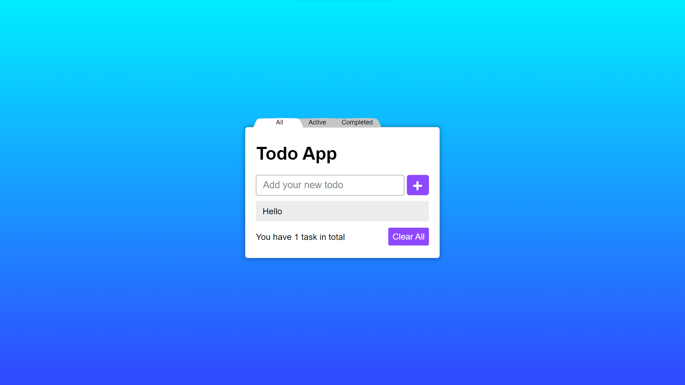

<h1>Todo-App-knockoutJS</h1>

    This is a sleek and visually appealing Todo-App built using Knockout.js. It
    allows users to efficiently manage their tasks with features such as adding
    new tasks and deleting existing ones. Tasks can be categorized into three
    modes: active, complete, and all.

<h2>Features</h2>
<ul>
    <li>
        

            <strong>Add Task</strong>: Easily add new tasks to your to-do list
            with an intuitive interface for quick entry of task details.
        

    </li>
    <li>
        

            <strong>Delete Task</strong>: Remove unwanted tasks from the list
            with a simple click, keeping your to-do list organized and
            clutter-free.
        

    </li>
    <li>
        

            <strong>Categorization</strong>: Categorize tasks into active,
            complete, and all modes for convenient viewing based on completion
            status.
        

    </li>
</ul>
<h2>Installation</h2>

To use this Todo-App, follow the instructions below:

<ol>
    <li>
        
Clone the repository

    </li>
    <li>
Open the project folder in your preferred code editor.
</li>
    <li>
        

            Launch the application by opening the
            <code>index.html</code> file in a web browser.
        

    </li>
</ol>
<h2>Technologies Used</h2>

    This Todo-App was developed using the following technologies and libraries:

<ul>
    <li>
        <strong>HTML</strong>: The standard markup language for creating the
        structure and elements of web pages.
    </li>
    <li>
        <strong>CSS</strong>: The style sheet language used for designing the
        visual presentation of web pages.
    </li>
    <li>
        <strong>JavaScript</strong>: The programming language that enables
        dynamic behavior and interactivity in web applications.
    </li>
    <li>
        <strong>Knockout.js</strong>: A powerful JavaScript library for building
        dynamic and responsive user interfaces. Knockout.js facilitates the
        creation of interactive web applications with a clean separation between
        data model and view components.
    </li>
</ul>
<h2>Contributing</h2>

    Contributions are welcome! If you would like to contribute to this project,
    please follow these steps:

<ol>
    <li>
Fork the repository.
</li>
    <li>
Create a new branch for your feature or bug fix.
</li>
    <li>
        

            Make your changes and commit them with descriptive commit messages.
        

    </li>
    <li>
Push your changes to your forked repository.
</li>
    <li>
        

            Submit a pull request, explaining the changes you have made and
            their purpose.
        

    </li>
</ol>
